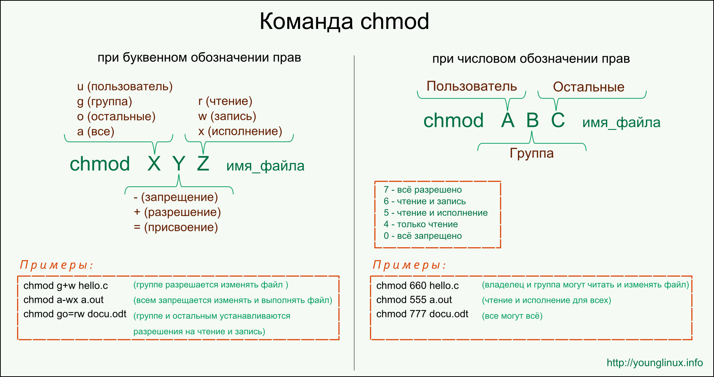

# Privilege

- `uid` - user id

- `gid` - group id

- `id` - info about user

- `/etc/passwd` - file that stores account information

- `/etc/group` - file that stores group information

- `/etc/shadow` - file that stores user's password

- `/etc/gshadow` - password for groups

#### Where created user, created note in /etc/shadow then created note in /etc/passwd

#### In /etc/passwd defined uid, gid, name, info(full name, number...)path to home dirand path to loggin shell

## Read, write and execute 

|1.|2. |3. |4. |
|--|---|---|---|
|d |rwx|rw-|r--|

1. Type of file

1. Privilege for owner

1. Privilege for group

1. Privilege for other users

#### Attributes of permission

|Attributes|For files                                                         |For directors                                                   |
|----------|------------------------------------------------------------------|----------------------------------------------------------------|
|`r`       |Open and read file                                                |Allow read only if execute also                                 |
|`w`       |Allow write,rewrite file, if dir haven't w can't rename n delete f|Allow reate, delete and rename files in dir, if execute also    |
|`x`       |Allow execute programm, scrips only if `r`                        |Allow `cd` in dir                                               |

## Command

- `chmod` - change privilege mode, work with symbol and 8 number

	- `--recursive` - change mode for dir and file in

#### Number

|8|2  |Access|
|-|---|------|
|0|000|`---` |
|1|001|`--x` |
|2|010|`-w-` |
|3|011|`-wx` |
|4|100|`r--` |
|5|101|`r-x` |
|6|110|`rw-` |
|7|111|`rwx` |

#### Symbolic

|Symbol|Value   |
|------|--------|
|`u`   |user    |
|`g`   |group   |
|`o`   |other   |
|`a`   |all(ugo)|

Default `all`

|Symbol|Value            |
|------|-----------------|
|`+`   |Add attrib       |
|`-`   |Rm attrib        |
|`=`   |Only that attribe|

- `umask` - `umask 0000` defind permission default that set where file created. Using octal form bit mask for reset permission mode.

|Additionaly value||Letter|Number|Description                                                                           |
|-----------------|-------|------|--------------------------------------------------------------------------------------|
|`setuid`         |s      |4     |Execute with owner of this file privilege                                             |
|`setgid`         |s      |2     |Execute with group of owner.If on directory file will create with dade dir group owner|
|`sticky`         |t      |1     |Ignore this attribe on file, but on dir this attrbe don't allow remove them           |

**Example:**

chmod u+s program

chmod g+s dir

chmod +t dir

## Substitute of user

**su [option] [-,(-l)] [user]**

- `su` - substitute user, can login in other user just in your shell, default user is root

	- `option` - advanced settings

		- `-c`, `--command="command"` - do command by user

		- `-s`, `--shell=shell` - use certain shell for user

		- `-`, `-l`, `--login` - change on user's shell and home dir

		- `-g`, `--group=group` - anly for user root, call user included in certain group.

	- `-` - change envirenment and home dir
	
	- `user` - user

**sudo [option] programm**

- `sudo` - Substitute user and do. Allow user do command by other user. Enter tour pass. 

	- `-k` - Not memeber pass on next few command

	- `-u` - by name do prog, without it option do by root

- `visudo` - can edit file by root privilege, but  where open file it's creat .tmp file, if file.tmp have error that file don't save changes, command for redact /etc/sudoers

**chown [user][:[group]] file or dir**

- `chown` -change owner and group for file or dir, only with root priviege

|Args     |Results                          |
|---------|---------------------------------|
|bob      |owner is bob                     |
|bob:users|owner bob group is users         |
|:admins  |group is admins                  |
|bob:     |owner is bob group is bob's group|

- `chgrp` - used in old ver of Unix, work with root privilege 

**passwd [user]**

- `passwd` - cange password of user

	- `-l` - lock to change password

	- `-u` - unlock to changr password
